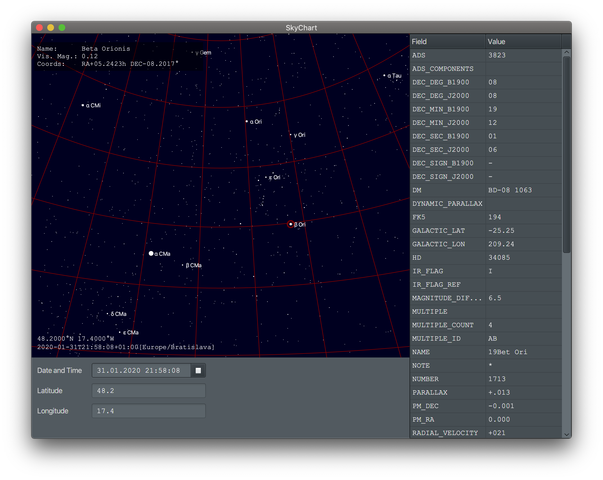

# SkyChart

SkyChart is an application which visualises the night sky.

## Running the Application

The application can be run using this Maven command:
```
mvn javafx:run
```

## User Guide

### Navigating Across the Skies

- Use arrows to look around the skies. 
- Use keys `M` and `N` to zoom in and out.
- Use left mouse button to select the star, and learn more about it. 
- Use space to pause or resume time.

### Time and Location

Date, time and location can be set at the bottom of the window using date picker and text fields for the location.
Latitude and longitude is measured in degrees.

### Star Info

After selecting the star, information about it will show up in the top-right corner.
Raw information from the catalogue can be found at the right side.

### Catalogue

SkyChart currently implements only one star catalogue, the [BSC5](http://tdc-www.harvard.edu/catalogs/bsc5.html). 
However, the code is extensible and more catalogues can be added.

## Screenshots




## Documentation

Link to the [documentation](http://www.ms.mff.cuni.cz/~grajcarp/skychart/apidocs/)

&copy; Peter Grajcar 2020